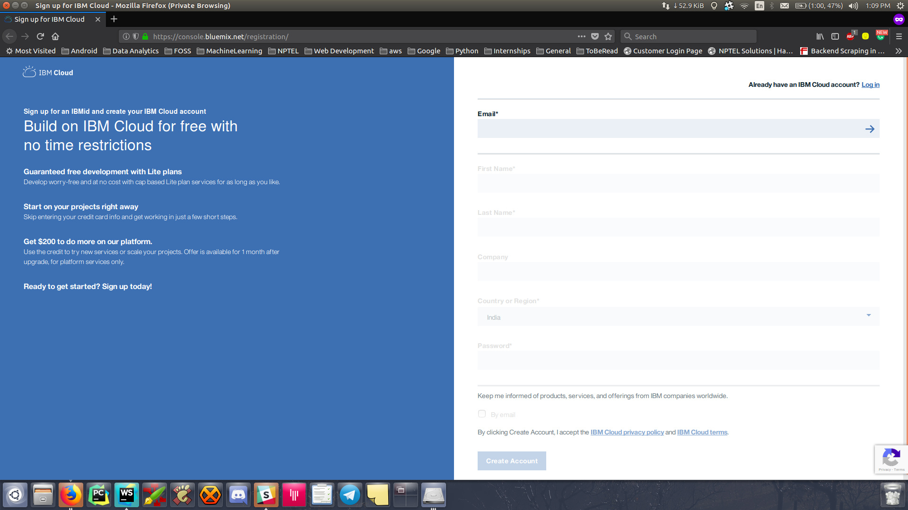
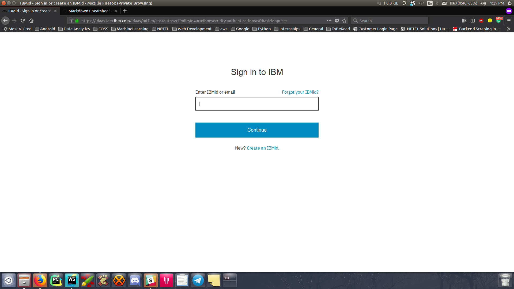
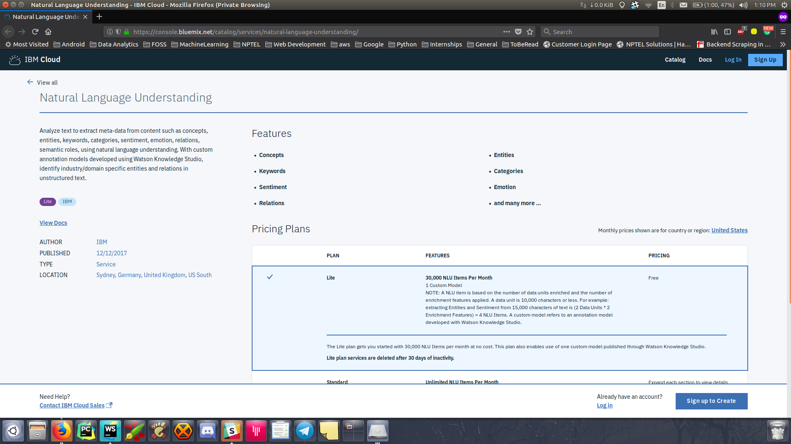
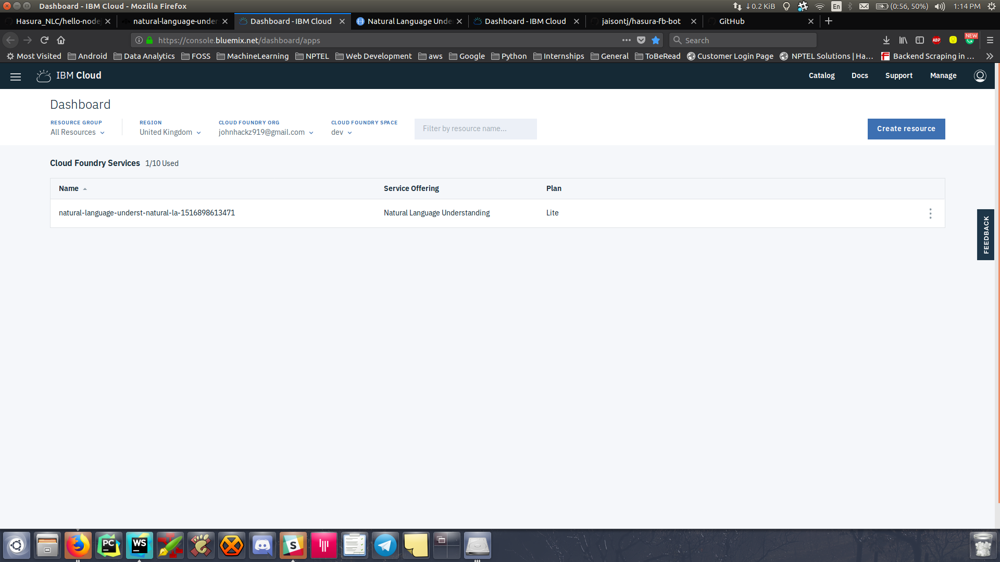
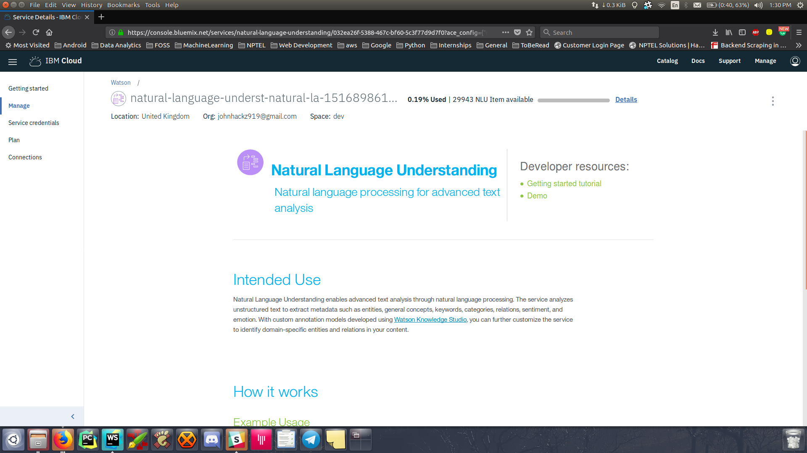
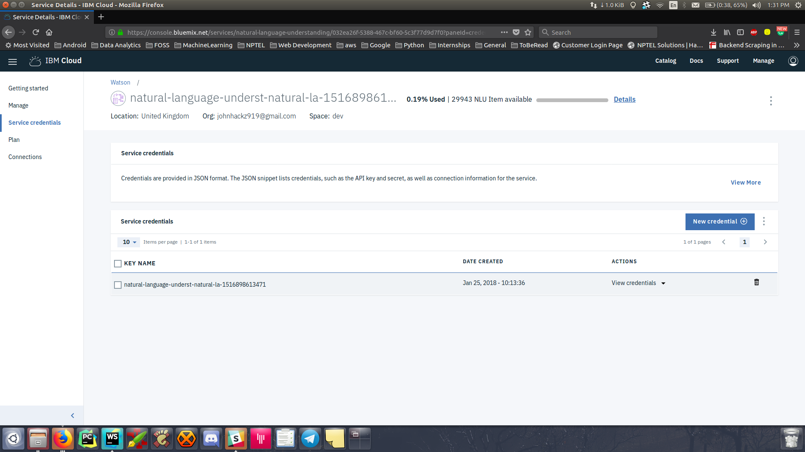

# IBM Watson - Natural Language Understanding

* Natural Language Understanding uses natural language processing to analyze semantic features of any text. Provide plain text, HTML, or a public URL, and Natural Language Understanding returns results for the features you specify. The service cleans HTML before analysis by default, which removes most advertisements and other unwanted content. 
## Pre-requisites

* We will use Node.js along with the express framework to build our server. Ensure that you have Node installed on your computer, do this by running `node-v` in the terminal. If you do not have Node installed you can get it from https://nodejs.org

* Before you begin, ensure that you have the latest version of the `hasura cli` installed. You can find instructions to download the `hasura cli` from [here](https://docs.hasura.io/0.15/manual/install-hasura-cli.html)

### Doing the basic setup in IBM Watson

* Navigate to https://console.bluemix.net/registration/ to register on IBM.



* Log in to IBM Cloud and go to the [Natural Language Understanding service page](https://console.bluemix.net/catalog/services/natural-language-understanding/).



* Click the "Create" button.



* Now head over to dashboard after you have created the service.



* Click on the service name in the dashboard which will take you to the NLU Service page.



* Click the "Service Credentials" tab on the Natural Language Understanding page in your [IBM Cloud dashboard](https://console.bluemix.net/dashboard/) to view your credentials.



* click on View Credentials to see your credentials to be used further.
```json
{
  "url": "https://gateway.watsonplatform.net/natural-language-understanding/api",
  "username": "dh4il910-241a-49a8-lk90-bd7b83a185f1",
  "password": "avb5hdbswk"
}
```

### Getting the Hasura project

```sh
$ # 1) Run the quickstart command
$ hasura quickstart hasura/hello-nodejs-express

$ # 2) Git add, commit & push to deploy to your cluster
$ cd hello-nodejs-express
$ git add . && git commit -m "First commit"
$ git push hasura master
```

After the `git push` completes:

```sh
$ hasura microservice list
```

You will get an output like so:

```sh
INFO Getting microservices...                     
INFO Custom microservices:                        
NAME   STATUS    INTERNAL-URL(tcp,http)   EXTERNAL-URL
bot    Running   bot.default              https://api.apology69.hasura-app.io

INFO Hasura microservices:                        
NAME            STATUS    INTERNAL-URL(tcp,http)   EXTERNAL-URL
auth            Running   auth.hasura              https://auth.apology69.hasura-app.io
data            Running   data.hasura              https://data.apology69.hasura-app.io
filestore       Running   filestore.hasura         https://filestore.apology69.hasura-app.io
gateway         Running   gateway.hasura           
le-agent        Running   le-agent.hasura          
notify          Running   notify.hasura            https://notify.apology69.hasura-app.io
platform-sync   Running   platform-sync.hasura     
postgres        Running   postgres.hasura          
session-redis   Running   session-redis.hasura     
sshd            Running   sshd.hasura              
vahana          Running   vahana.hasura
```

Find the EXTERNAL-URL for the service named `api`(in this case -> https://api.apology69.hasura-app.io).


## Tutorial

Follow along for a step by step guide on developing and deploying this facebook messenger bot on Hasura.

## Sections
* [Architecture](#architecture)
* [Getting started](#getting-started)
 
## Architecture


## Getting started

### Adding additional node dependencies

Navigate to `microservices/bot/app/src` (the directory with the `package.json` file)

```sh
$ npm install request body-parser --save
```

* The above command installs two modules(libraries) "request" and "body-parser" into our app.
* **request** is for sending out messages and **body-parser** is to process messages.
* Once again, open up the **server.js** and add the following at the top of your file:

```javascript
    var bodyParser = require('body-parser');
    var request = require('request');
```

and the following after **var app = express();**

```javascript
    // Process application/x-www-form-urlencoded
    app.use(bodyParser.urlencoded({extended: false}));

    // Process application/json
    app.use(bodyParser.json());
```

* Your **server.js** file should now look like so:

```javaScript
    var bodyParser = require('body-parser');
    var request = require('request');
    var express = require('express');
    var app = express();

    // Process application/x-www-form-urlencoded
    app.use(bodyParser.urlencoded({extended: false}));

    // Process application/json
    app.use(bodyParser.json());

    //your routes here
    app.get('/', function (req, res) {
      res.send("Hello World!");
    });

    app.listen(8080, function () {
      console.log('Example app listening on port 8080!');
    });
```
## Getting started with IBM Watson - NLU service

### Step 1  - Authentication

Replace {username} and {password} with your credentials which you generated in Service Credentials.

```javascript
var NaturalLanguageUnderstandingV1 = require('watson-developer-cloud/natural-language-understanding/v1.js');
var natural_language_understanding = new NaturalLanguageUnderstandingV1({
  'username': '{username}',
  'password': '{password}',
  'version_date': '2017-02-27'
});
```

### Step 2 - Making a POST call to the service to categorise the text.

```javascript
app.post('/', function (req, res) {
    var inputString = req.body.input;
    compute(inputString);

    function compute(input) {
        var parameters = {
            'text': input,
            'features': {
                'categories': {}
            }
        };

        natural_language_understanding.analyze(parameters, function (err, response) {
            if (err)
                console.log('error:', err);
            else
                resp = JSON.stringify(response, null, 2);
            console.log(resp);
            sendRes(resp);
        });
    }

    function sendRes(output){
        res.setHeader('Content-Type', 'application/json');
        res.send(output);
    }
});

```

The above snippet does the following:
1. Authentication with `IBM WATSON - NLU Service`.
2. We a `post` route setup to which the `front-end` makes a call.
3. The function `compute(input)` is executed by the post request.
4. And returns a `JSON` in the response.

## Example - 

* The example response printed in the logs will look like so

```json
    {
      "usage": {
        "text_units": 1,
        "text_characters": 1536,
        "features": 1
      },
      "retrieved_url": "https://www.ibm.com/us-en/",
      "categories": [
        {
          "score": 0.594296,
          "label": "/technology and computing/software"
        },
        {
          "score": 0.448495,
          "label": "/science/mathematics/statistics"
        },
        {
          "score": 0.426429,
          "label": "/business and industrial"
        }
      ],
      "language": "en"
    }
```